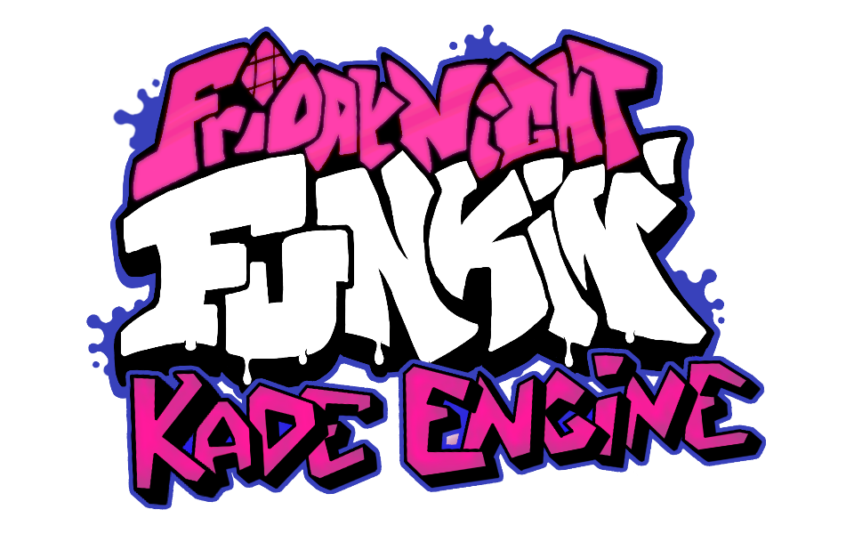

# Funktopia: A Friday Night Funkin' Miitopia Mod

IF YOU MAKE A MOD AND DISTRIBUTE A MODIFIED / RECOMIPLED VERSION, YOU MUST OPEN SOURCE YOUR MOD AS WELL!
This is the repository for Funktopia! A mod of Friday Night Funkin's Kade Engine!

## Friday Night Funkin'

**Friday Night Funkin'** is a rhythm game originally made for Ludum Dare 47 "Stuck In a Loop".

### Links
 - [itch.io](https://ninja-muffin24.itch.io/funkin)
 - [Newgrounds](https://www.newgrounds.com/portal/view/770371)
 - [GitHub](https://github.com/ninjamuffin99/Funkin)

## Kade Engine
**Kade Engine** is a mod for Friday Night Funkin', it includes a full engine rework, replays, and more!

### Links
 - [GameBanana](https://gamebanana.com/gamefiles/16761)
 - [Github](https://github.com/KadeDev/Kade-Engine)
 - [Official Website](https://KadeDev.github.io/Kade-Engine/)

# Credits

### Friday Night Funkin'
 - [ninjamuffin99](https://twitter.com/ninja_muffin99) - Programmer
 - [PhantomArcade3K](https://twitter.com/phantomarcade3k) - Artist
 - [Evilsk8r](https://twitter.com/evilsk8r) - Artist
 - [Kawai Sprite](https://twitter.com/kawaisprite) - Musician

### Kade Engine
 - [KadeDeveloper](https://twitter.com/KadeDeveloper) - Programmer
 - ...You can find the rest on Kade Engine's Github Page. (They are a bunch!)

### Funktopia
 - [ScardyFluff]() - Programmer/Artist
 - [Star Victini](https://www.youtube.com/channel/UCllDwoyq-qD0Gi8xnysciBw) - Musician
 - Gleam - Named the Mod
